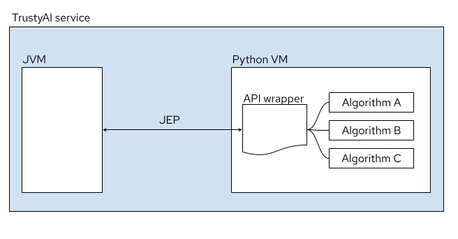
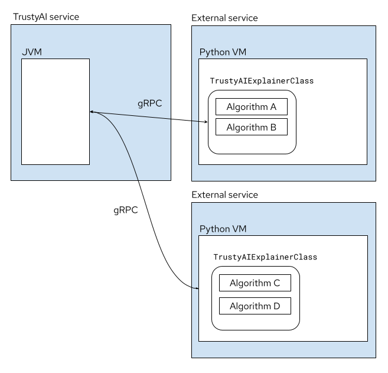
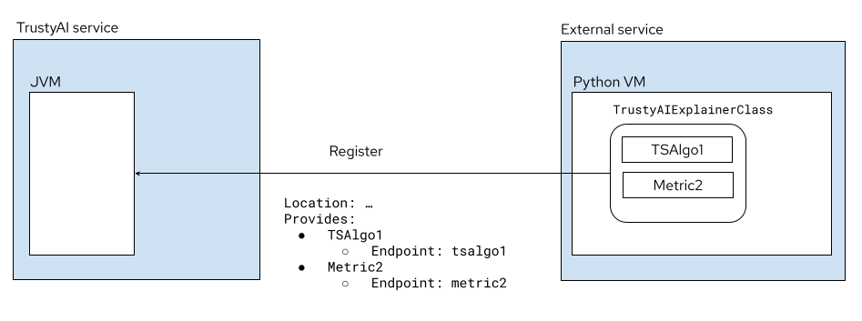
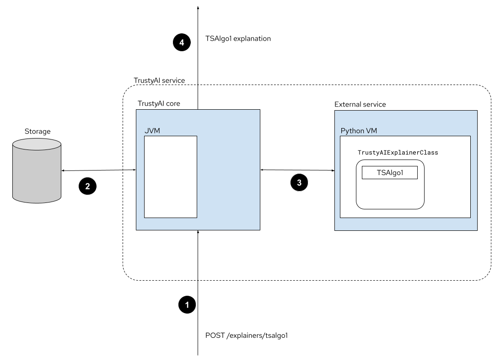

# Title

TrustyAI external library integration

## Context and Problem Statement

[TrustyAI Service](https://github.com/trustyai-explainability/trustyai-explainability/tree/main/explainability-service) is a Java/Quarkus component that enables the integration with ModelMesh (via [PayloadProcessor](https://github.com/kserve/modelmesh/pull/84)) to bring Trustworthy AI to ODH/RHODS. One of the existing limitations is that it is not possible to plug / extend the set of algorithms that are included in the solution.
To overcome this limitation we also need to consider that many AI algorithms are written in Python so the proposal needs to consider this aspect. TrustyAI algorithms are already available for Python users via a [Python binding module](https://github.com/trustyai-explainability/trustyai-explainability-python) but the technology used for that, [JPype](https://github.com/jpype-project/jpype), is Python to Java only and not vice versa.

## Goals

* Ability to extend TrustyAI with third-party libraries for explainability and fairness/bias metrics
* Minimal impact on the current TrustyAI service external API
* Must conform to Open Data Hub general architecture
* Allow the integration with non-Java libraries, in particular Python libraries

## Non-goals

N/A

## Current situation

Since the TrustyAI algorithmic core is written in Java, as well as the TrustyAI service which provides all the ODH integration (ModelMesh payload consumption, data storage handling, Prometheus publishing and REST endpoints), the only way to add new explainers or metrics is to implement them in Java or add them as a dependency, if available as a Java library.
Although the Python bindings for TrustyAI exist, their purpose is to invoke the Java algorithms from Python and not the other way around.
At the moment there is no out of the box solution for TrustyAI to leverage the existing explainability libraries, which arguably are written for Python.

## Proposal

### Proposal 1 - Embedding: Java -> Python bridge

[jep](https://github.com/ninia/jep) is a Java library that allows embedding Python code in Java applications.
For this proposal:

* An API wrapper, written in Python will be used as a “front-end” to the Python libraries. This API will have the responsibility of translating Java data structures into Python and vice versa.
* The Java service will execute the Python algorithms by invoking the API wrapper and passing all the necessary data, read from storage.
* Python results will be converted into Java data structures
* Results will be returned by the service (either as responses to ad-hoc requests, or as a Prometheus data). This step is handled exclusively by the Java part. As such, the external communication is delegated to the service.

The API wrapper would provide a general enough abstraction for explainers and metrics so that they could be treated by the TrustyAI service as a regular Java implementation. Any Python implementation-specific initialization or configuration would be implemented on the wrapper side.
jep provides specific optimizations for the serialization/deserialization of numpy data (in the form of Java types `NDFloat`, etc) which could be leveraged in this scenario.

**Pros:**

* External algorithms co-located with TrustyAI service
* Fewer external calls / network communication

**Cons:**

* Increase complexity of TrustyAI service (dependency tracking and updating)
* Adding new algorithms requires hardcoding
* Reduced flexibility (third party libraries need to be added directly)

### Proposal 2 - Container/Microservice composition: Sidecar container

This proposal is based on [KServe’s approach to model explainability](https://kserve.github.io/website/0.8/modelserving/explainer/explainer/#inferenceservice-explainer). We assume the case of Python external libraries which need to be used as the algorithmic backend for the TrustyAI service.

* A Python base class is provided, which implements the intra-service communication transparently (e.g. an “explain” method, a “register” method, etc).
  * Communication between TrustyAI and external service implemented in gRPC
* External Python algorithms are implemented as a subclass and packaged as a container.
* When the external service is deployed, it automatically registers its capabilities with a TrustyAI service, providing
  * The external service’s location
  * The external service’s capabilities (algorithm names, TrustyAI endpoint claim)
* A request to TrustyAI for an explainer/metric matching the externally registered ones will be invoked by
  * Passing data to the external service
  * External service executes computations
  * Final result is returned to TrustyAI
* TrustyAI published result to Prometheus or return response if it’s an ad-hoc request

**Pros:**

* Extensible for any external service that implements the API

**Cons:**

* Limitations of passing large amount of data through the gRPC channel
* Communication API should accommodate different explainer/metric APIs
* Write gRPC client/service protobuf

## Alternatives Considered / Rejected

N/A

## Challenges

### Proposal 1

* Establish general API for explainers and metrics

### Proposal 2

* Establish general API for explainers and metrics (gRPC)
* Data transfer limitations
* Deployment of side-container

## Dependencies

### Proposal 1

* Jep library (and associated jep JNI native library)
* Python in container image
* External Python libraries in container image

### Proposal 2

* None (gRPC client already included in TrustyAI service dependencies)

### Consequences if not completed

TBD
